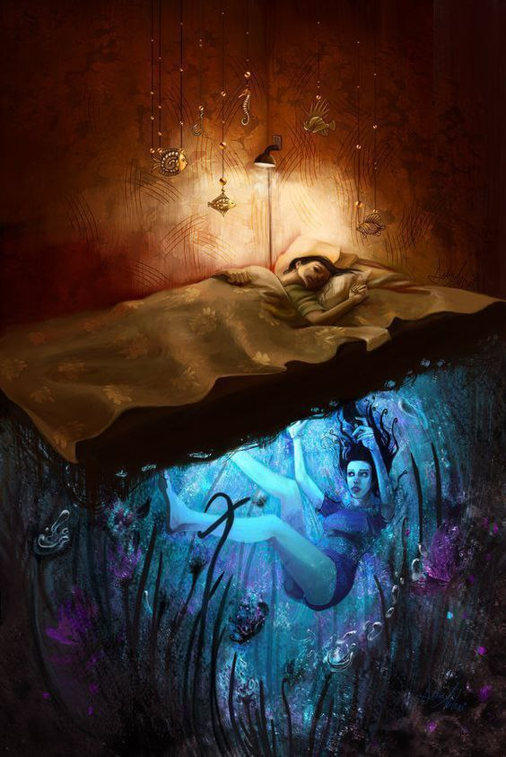
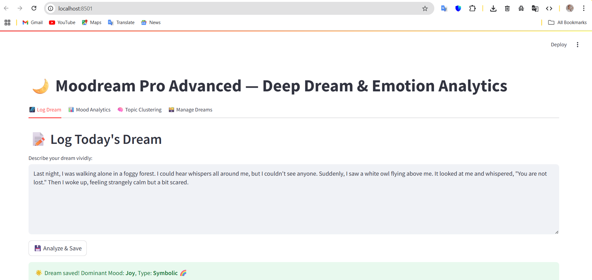

## Moodream — An AI-Powered Dream & Mood Analyzer using Runner H 😴🌙

---
title: Moodream — An AI-Powered Dream & Mood Analyzer using Runner H 😴🌙
published: true
tags: devchallenge, runnerhchallenge, ai, mentalhealth
cover_image: https://i.imgur.com/PVhDNST.jpg

---

## 💤 Moodream — AI Dream & Mood Journal with Runner H

Hi everyone! I'm Vida from Iran 🇮🇷  
This is my submission for the Runner H AI Prompting Challenge 🧠

---

### ✨ What is Moodream?

**Moodream** is a personal project designed to help users record and analyze their dreams and moods using AI, bridging the worlds of subconscious experiences and emotional well-being.  

Currently, it supports:  
- 🧠 Daily dream journaling via text input  
- 💖 Basic emotional tone detection using sentiment analysis  
- 🗂️ Categorization of dream types (e.g., nightmares, recurring dreams)  
- 📈 Generation of simple monthly reports summarizing dream patterns and moods  

---

### 🧠 How Runner H powers Moodream:

- Prompts users daily to share their dream descriptions  
- Extracts key themes and symbols using NLP techniques  
- Analyzes emotional tones like fear, joy, anxiety, or longing  
- Classifies dreams by type through clustering and keyword analysis  
- Tracks mood trends over time with visual reports  

---

### 🌈 Example Prompt for Runner H:

> “User describes last night’s dream:  
> ‘I was flying over a purple sea and met an old friend.’  
> Analyze and store this dream. Detect mood. Classify type. Add to journal.”

---

### 📅 Sample Monthly Report:

> - Total dreams logged: 12  
> - Nightmares: 2  
> - Recurring dreams: 3  
> - Most common emotion: **longing**  
> - Mood trend: 🔻 early in the month, 🔼 after day 20  
> - Suggested tip: Try guided sleep meditation 🌿

---

### 🚀 Future Development & Vision

Moodream is a functional prototype that sets the foundation for a more comprehensive mental wellness tool. Planned improvements include:

- **Voice input integration** for easier dream journaling  
- **Advanced NLP and sentiment analysis** using transformer-based models for nuanced emotion detection  
- **User-friendly, responsive UI** with rich data visualization and interaction  
- **Personalized feedback and recommendations** based on dream and mood patterns  
- **Cloud-based storage and multi-device synchronization** for seamless user experience  
- **Habit-building features** like reminders and motivational notifications  

With these enhancements, Moodream aims to become a trusted digital companion for self-discovery and mental health support.

---

### 🎥 Demo Video

Watch Moodream in action on YouTube:  
👉 [https://youtu.be/your_youtube_video_id](https://youtu.be/your_youtube_video_id)

---

### 📂 Source Code

Explore the code, contribute, or report issues:  
👉 [https://github.com/VIDAKHOSHPEY22/ِDream_mood](https://github.com/VIDAKHOSHPEY22/Dream_mood)

---

### 💬 Feedback & Collaboration

I’d love to hear your thoughts! Would you use a tool like Moodream?  
What features or improvements would you suggest?  
Connect with me on X (Twitter):  
👉 [@VidaTwin16133](https://x.com/VidaTwin16133)

Thanks to DEV and Runner H for this incredible opportunity! 💙
